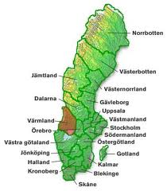
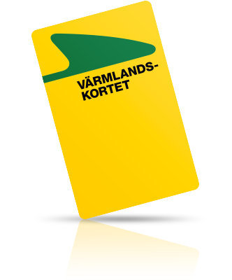

:data-transition-duration: 500
:css: cdip.css

.. title: The Point of Pointless Projects

.. |twitter| image:: images/twitter.png
.. |instagram| image:: images/insta.png
.. |github| image:: images/github.png
.. |githubsmall| image:: images/github.png 
    :height: 32px
.. |githubmini| image:: images/github.png 
    :height: 16px

----

:id: first-slide

Civil Disobedience in Python
============================

Henrik Blidh
------------

|twitter|

**@hbldh**

.. note::

    Hello and welcome to this presentation called Civil Disobedience by Python.

----

:data-x: r3000

:class: center-slide

Värmland
========

.. note::

    I'm from Värmland, located here in Sweden if you do not know.

----

:class: center-slide

Värmlandstrafik
===============

The public transport company in Värmland, **Värmlandstrafik**, has at the start of this year removed
several countryside train stations.

This has been in discussion for a long time and has been opposed by many commuters, politicians and general believers in an accessible countryside.

.. note::

    Read text

----

:class: center-slide

Someone got annoyed...
======================

Combining this with the worst onboard wifi imaginable made someone decide to send a message...

.. note::

    No notes

----

:class: center-slide

Commuters pass
==============

.. note::

    Card image.

----

:class: center-slide

Commuters pass
==============

.. image:: images/receipt.jpg
	:width: 340px

.. note::

    Reciept image.

----

:class: center-slide

WTF?
====

**Ocular inspection of paper slip even though you have registered the transaction of a card?! In 2017?!**

There must be a better way...

.. note::

    Battle stations...

----

:class: center-slide

Värmlandstrafejk
================

The frustrated individual mentioned before, going by the moniker **InfuriatedTraveler** created the Python package **varmlandstrafejk**, a simple image manipulation library for generating counterfeit receipts.

Using a scanned receipt images as templates and building blocks, it uses ``numpy`` to modify a grayscale image matrix with card number and valid dates.

Stick this behind a flask webapp that generates and delivers these receipts, and the civil disobedience is (almost) done.

----

Making it available to the public
=================================

1. Use Tor and Whonix virtual boxes.
2. Create anonymous Gmail account
3. Create Github account and deposit code there.
4. Register AWS account and spin up a t2.micro instance
5. Deploy Flask app behind nginx with Let's Encrypt cert.
6. Register free domain (``varmlandstrafejk.tk``)
7. Done.

----

:class: center-slide

What do I want to say with this?
================================

----

:class: center-slide

With great power comes great responsibility
===========================================

.. image:: images/spider400.jpg
    :height: 400px

----

:class: center-slide

Python == Superpower
====================

I hope you realize the power you have available at the tips of your fingers.

You can effect social change by coding!

Make a difference!

.. note::

    Allright!

----

:class: center-slide

So, what happened?
==================

Did they resume traffic at the stations again?

No.

They finally gave every train warden a portable reader.

You can't win them all.

At least they made a move towards the digital world...

.. note::

    The result

----

:class: center-slide

Thank you for listening!
========================

